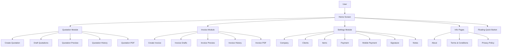
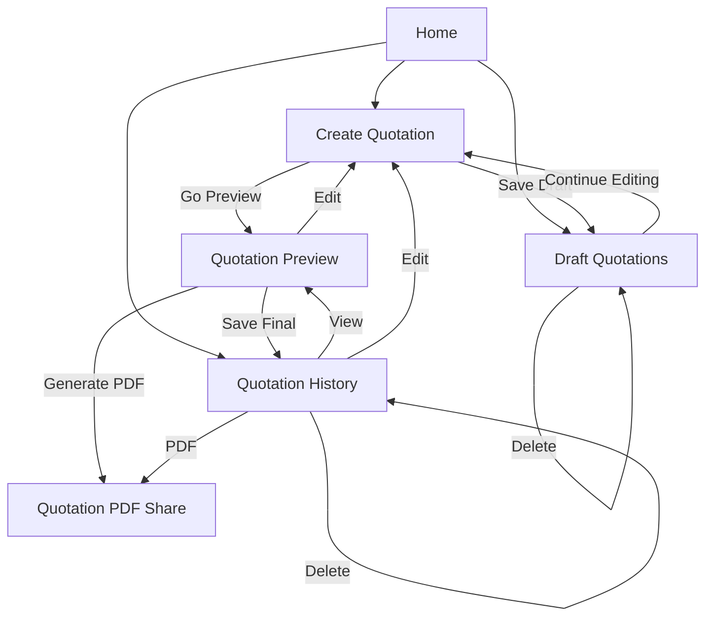
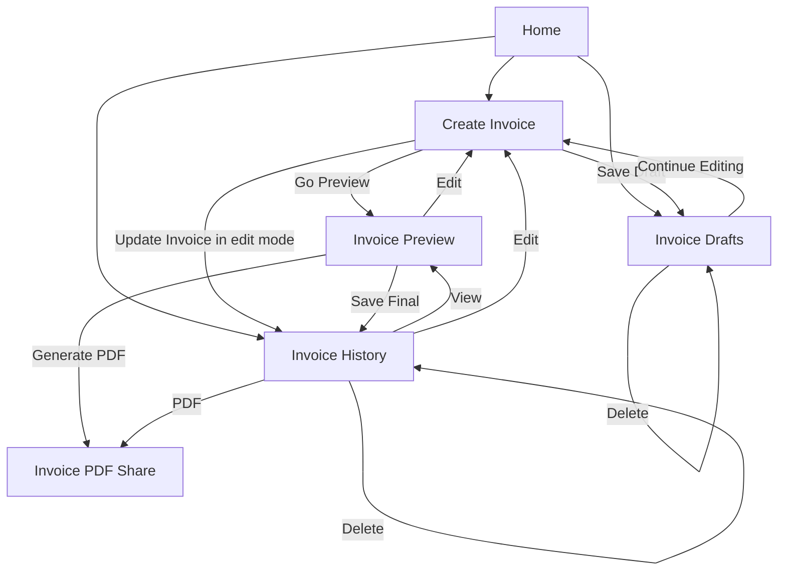
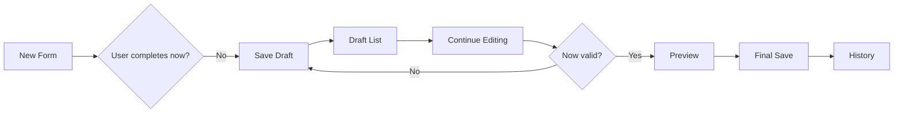
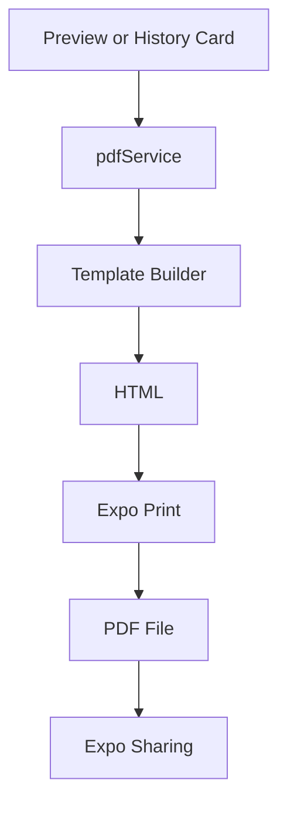

# Invoice & Quotation Generator — Master Project Documentation

## Product Overview, User Journey, Developer Architecture, Data Flow, AI Handoff Guide, and Future Upgrade Blueprint

---

## Document Purpose

This document is the **master blueprint** for the **Invoice & Quotation Generator** mobile application.

It is written for four different audiences at the same time:

1. **General readers** who want to understand what the app is and why it exists.
2. **Users or product owners** who want to understand how the app is used in real workflows.
3. **Developers** who need to understand the architecture, files, screens, services, data flow, and safe modification rules.
4. **Future AI coding assistants** that may need to resume development years later from the current project state without breaking existing working flows.

This document should be stored together with:

```text
1. Latest full project ZIP
2. Current README.md
3. This Master Project Documentation
4. Any release audit notes or known issue notes
```

When these files are preserved together, a future developer or coding AI should be able to understand the project, inspect the source code, compare the code with this documentation, and continue development safely.

---

# 1. Executive Summary

The **Invoice & Quotation Generator** is a mobile-first, offline-first business document application built with **Expo** and **React Native**.

Its core purpose is to help freelancers, agencies, shops, service providers, and small businesses create and manage:

- **Quotations**
- **Invoices**
- **Drafts**
- **Saved history records**
- **PDF exports**
- **CSV backups/imports**
- **Reusable business presets**

The app is designed to reduce repeated typing and prevent document mistakes by combining:

- Reusable preset data from Settings
- Validation before final save/PDF
- Draft workflows for incomplete data
- History workflows for completed documents
- PDF generation and sharing
- CSV backup/import support
- Mobile-friendly UI patterns

The project has reached a **feature-complete beta / release-candidate style stage**, meaning the major product flows already exist and are functioning. The remaining work is mainly:

- Final regression testing
- Play Store release preparation
- Optional future upgrades
- Optional code cleanup/refactoring after stability lock

---

# 2. The Problem This App Solves

Many small businesses and individual professionals repeatedly type the same information when creating quotations or invoices:

- Company details
- Client details
- Item/service descriptions
- Payment terms
- Mobile payment information
- Notes
- Signature/logo

This is slow, error-prone, and difficult to manage manually on mobile.

The app solves this by providing:

```text
Saved preset data + Document builder + Drafts + History + PDF + Backup
```

This means a user can:

1. Save their company, clients, items, payment terms, notes, and signature once.
2. Reuse those presets when creating quotations or invoices.
3. Save incomplete work as a draft.
4. Finalize and preview only when required fields are complete.
5. Save the finished document into history.
6. Generate/share a professional PDF.
7. Export or import backups when needed.

---

# 3. Intended Users

## 3.1 Primary User Groups

| User Type | Why They Need the App |
|---|---|
| Freelancer | Send quotes and invoices quickly from phone |
| Agency | Manage client proposals and billed work |
| Small Business | Track quotations, invoices, and reusable customers/items |
| Shop or Service Provider | Create structured price offers and payment documents |
| Contractor | Save unfinished documents and finalize later |
| Individual Professional | Maintain document history without a desktop system |

---

# 4. Product Positioning

The app is best described as:

```text
A local-first mobile quotation and invoice document generator
with reusable presets, draft protection, PDF sharing, history management,
and CSV backup/import support.
```

It is not designed as a full accounting system or ERP. Instead, it focuses on:

- Document creation
- Document management
- Reliable draft-to-history flows
- Mobile convenience
- Backup portability

---

# 5. Current Project Snapshot

## 5.1 Current Development Stage

```text
Project State: Feature-complete beta / release-candidate stage
Play Store Readiness: Preparation-ready, final release checks still needed
```

## 5.2 Major Completed Areas

```text
✅ Quotation create / draft / preview / history / PDF
✅ Invoice create / draft / preview / history / PDF
✅ Validation rules for final documents
✅ Unsaved protection and auto-draft behavior
✅ Draft lifecycle cleanup after final save
✅ History select/filter/search/pagination/export/import flows
✅ Settings preset modules
✅ CSV backup/import for reusable Settings data
✅ Floating quick action menu
✅ About, Terms & Conditions, Privacy Policy pages
✅ Mobile UI consistency improvements
```

## 5.3 Optional Future Areas

```text
⬜ Draft CSV backup/import for quotation drafts
⬜ Draft CSV backup/import for invoice drafts
⬜ Currency selector / localization
⬜ Cloud backup
⬜ Authentication
⬜ Multi-language support
⬜ Reporting/dashboard
⬜ Production build polish and store release assets
```

---

# 6. Core Product Philosophy

The app follows several guiding principles:

## 6.1 Separate Drafts from Final Records

Incomplete work should not pollute saved business history.

```text
Draft = unfinished, revisable work
History = final saved business record
```

## 6.2 Validate Final Output, Not Draft Creativity

Users can save partial data as drafts, but cannot create incomplete final documents or PDFs.

```text
Partial data → Draft allowed
Incomplete final data → Preview/save/PDF blocked
```

## 6.3 Reuse Data Instead of Repeated Typing

Settings presets should help users fill forms faster:

- Company
- Client
- Items
- Payment
- Mobile payment
- Signature
- Notes

## 6.4 Preserve User Work

The app includes safeguards:

- Unsaved leave protection
- Auto-draft on app background
- Draft continue workflows
- Draft final save cleanup

## 6.5 Keep Quotation and Invoice Logic Related but Separate

Quotation and Invoice have similar overall flows, but their data models and storage paths must remain safely separated.

---

# 7. High-Level System Map

## 7.1 Plain-Language Map

```text
User
  ↓
Home Screen
  ├── Quotation System
  │     ├── Create Quotation
  │     ├── Draft Quotations
  │     ├── Preview Quotation
  │     ├── Quotation History
  │     └── Quotation PDF
  │
  ├── Invoice System
  │     ├── Create Invoice
  │     ├── Draft Invoices
  │     ├── Preview Invoice
  │     ├── Invoice History
  │     └── Invoice PDF
  │
  ├── Settings Preset System
  │     ├── Company
  │     ├── Clients
  │     ├── Items
  │     ├── Payment
  │     ├── Mobile Payment
  │     ├── Signature
  │     └── Notes
  │
  ├── Information Pages
  │     ├── About
  │     ├── Terms
  │     └── Privacy
  │
  └── Floating Quick Button
        └── Fast navigation shortcuts
```

## 7.2 Mermaid Architecture Diagram



---

# 8. Full User Journey Overview

## 8.1 Quotation Journey

```text
Open Home
  ↓
Create Quotation
  ↓
Fill company/client/items/payment data
  ↓
Need to stop?
  ├── Yes → Save as Draft → Draft Quotations
  └── No → Go to Preview
                ↓
             Validation
                ├── Incomplete → Save as Draft option
                └── Complete → Preview opens
                                   ↓
                         Save Quotation / Generate PDF
                                   ↓
                                History
                                   ↓
                 View / Edit / PDF / Delete / Export / Import
```

## 8.2 Invoice Journey

```text
Open Home
  ↓
Create Invoice
  ↓
Fill company/client/items/date/payment data
  ↓
Need to stop?
  ├── Yes → Save as Draft → Invoice Drafts
  └── No → Go to Preview
                ↓
             Validation
                ├── Incomplete → Save as Draft option
                └── Complete → Preview opens
                                   ↓
                         Save Invoice / Generate PDF
                                   ↓
                              Invoice History
                                   ↓
                 View / Edit / PDF / Delete / Export / Import
```

---

# 9. Navigation Architecture

## 9.1 Main Navigation Concept

The app uses a central navigator that registers the main route names and also hosts the globally visible Floating Quick Button.

## 9.2 Route Groups

### Core Routes

```text
Home
Create
Preview
History
DraftQuotation
CreateInvoice
InvoicePreview
InvoiceDraft
InvoiceHistory
Settings
```

### Settings Routes

```text
CompanySettings
ClientSettings
ItemsCatalogSettings
PaymentSettings
MobilePaymentSettings
SignatureSettings
NotesSettings
FloatingQuickButtonSettings
```

### Information Routes

```text
AboutUs
TermsConditions
PrivacyPolicy
```

---

# 10. Navigation Flow Maps

## 10.1 Quotation Navigation Flow



## 10.2 Invoice Navigation Flow



---

# 11. App Module Inventory

| Module | Purpose |
|---|---|
| Home | Landing and quick entry points |
| Quotation | Create/manage quotations |
| Invoice | Create/manage invoices |
| Drafts | Store incomplete documents |
| History | Store final saved documents |
| Preview | Review complete document before save/PDF |
| PDF | Generate shareable PDF files |
| Settings | Reusable preset data |
| Backup/Import | CSV export/import/conflict handling |
| Floating Quick Button | Quick navigation shortcut layer |
| Info Pages | About, Terms, Privacy |

---

# 12. Quotation Module Deep Dive

## 12.1 What a Quotation Represents

A quotation is a proposed business offer. It may include:

- Company details
- Client details
- Quotation number
- Date
- Validity period
- Services/items
- Pricing
- Payment information
- Notes
- Logo/signature

## 12.2 Key Screens

```text
CreateQuotationScreen.js
PreviewScreen.js
HistoryScreen.js
DraftQuotationScreen.js
```

## 12.3 Create Quotation Responsibilities

The Create Quotation screen:

- Loads default presets for new quotations
- Loads draft data in draft mode
- Loads saved quotation data in edit mode
- Manages company/client/item/payment/note/signature inputs
- Calculates subtotal, discount, tax, and total
- Validates final actions
- Saves draft records
- Supports auto-draft and unsaved leave protection
- Sends validated data to Preview
- Updates saved quotation from edit mode

## 12.4 Quotation Final Validation

Before final preview or update:

```text
Company Name required
Client Name or Client Company required
At least one valid service/item required
Item/service requires name or description
Quantity > 0
Price > 0
Grand Total > 0
```

## 12.5 Quotation Draft Behavior

Draft saving is allowed for partial data.

```text
Empty form → No draft
Partial form → Draft allowed
Meaningful edits → Can be preserved
```

## 12.6 Quotation Draft Final Save Cleanup

When a draft quotation is finalized and successfully saved from Preview, the source draft is cleaned up. This prevents the same business document from staying unnecessarily in both Draft and History after finalization.

## 12.7 Quotation History Features

Quotation history includes:

- Search
- Reset
- Filters
- Select mode
- Pagination
- View
- Edit
- PDF
- Delete
- Export selected PDFs
- Export selected CSV
- Export filtered CSV
- Full backup
- Import CSV
- Conflict handling

---

# 13. Invoice Module Deep Dive

## 13.1 What an Invoice Represents

An invoice is a bill/request for payment. It may include:

- Company details
- Client details
- Invoice number
- Invoice date
- Due date
- Reference quotation number
- Items/services
- Pricing
- Payment amount/due amount/status
- Payment details
- Notes
- Logo/signature

## 13.2 Key Screens

```text
CreateInvoiceScreen.js
InvoicePreviewScreen.js
InvoiceHistoryScreen.js
InvoiceDraftScreen.js
```

## 13.3 Create Invoice Responsibilities

The Create Invoice screen:

- Loads default presets for new invoices
- Loads draft data in draft mode
- Loads saved invoice data in edit mode
- Handles invoice-specific fields such as invoice date, due date, reference quote, payment status
- Calculates pricing and payment status
- Validates final actions
- Saves drafts
- Supports auto-draft and unsaved leave protection
- Sends validated data to Invoice Preview
- Updates saved invoice in edit mode

## 13.4 Invoice Final Validation

Before final preview, final save, PDF, or update:

```text
Company Name required
Client Name or Client Company required
At least one valid service/item required
Item/service requires name or description
Quantity > 0
Price > 0
Grand Total > 0
```

## 13.5 Invoice Draft Behavior

Invoice drafts are stored within a master invoice record model using lifecycle flags. This is a mature design because the same invoice record can move between:

```text
draft → saved
saved → draft
```

without creating accidental duplicates.

## 13.6 Invoice Edit Mode

When opening an invoice from History → Edit:

- The header shows Edit Invoice context
- A notice card explains edit mode
- Footer action uses **Update Invoice**
- If incomplete, validation blocks update and can offer Save as Draft
- If complete, update returns to History and preserves record identity

## 13.7 Invoice History Features

Invoice history includes:

- Search
- Filters
- Select mode
- Pagination
- View
- Edit
- PDF
- Delete
- Export selected PDFs
- ZIP PDF export
- CSV export/import
- Conflict handling
- Draft preservation during import

---

# 14. Draft Lifecycle Architecture

## 14.1 Generic Draft Lifecycle



## 14.2 Quotation Draft Rules

```text
Quotation drafts are stored separately from quotation history.
Final save from draft removes the source draft after successful history save.
```

## 14.3 Invoice Draft Rules

```text
Invoice draft and saved invoice records share a master invoice record model.
Lifecycle state indicates whether a record belongs in Drafts or History.
```

## 14.4 Why Drafts Matter

Drafts serve four important purposes:

1. Preserve unfinished work.
2. Avoid forcing final validation before the user is ready.
3. Protect against accidental app background/leave loss.
4. Keep History clean by preventing incomplete records from being treated as final documents.

---

# 15. History Lifecycle Architecture

## 15.1 What History Means

History screens contain finalized or saved document records.

History records support:

- View
- Edit
- PDF
- Delete
- Search/filter/select
- Export/import

## 15.2 View vs Edit vs PDF

| Card Action | Meaning |
|---|---|
| View | Open read/preview-style document page |
| Edit | Open create screen in edit mode |
| PDF | Generate/share PDF directly |
| Delete | Remove saved record after confirmation |

## 15.3 Bulk Actions

History screens support select mode and bulk operations:

- Select current page
- Select all matching/filter result
- Mark clear
- Export selected PDFs
- ZIP selected PDFs when multiple
- Export selected CSV backup

---

# 16. Settings Preset Architecture

## 16.1 Purpose

Settings pages store reusable data for fast document creation.

## 16.2 Preset Categories

```text
Company Information
Client Profiles
Items Catalog
Payment Terms & Method
Mobile Payment Info
Signature
Notes
```

## 16.3 Data Reuse

Create screens can load Settings presets through dropdown selectors. This reduces typing and ensures consistency.

Example:

```text
Create Quotation / Create Invoice
  ↓
Select Client Preset
  ↓
Client name, company, address, email, phone fill automatically
```

## 16.4 Defaults

Many preset types support a default item. Defaults may load automatically in new Create screens.

---

# 17. Settings Backup / Restore Architecture

## 17.1 Supported Settings Backup Features

Each supported Settings page includes:

- Export All
- Select Mode
- Export Selected
- Single Card Export
- Import CSV
- Conflict Detection

## 17.2 Import Conflict Options

```text
Skip Duplicates
Replace Existing
Keep Both
```

## 17.3 Why Conflict Handling Exists

It prevents accidental data loss or duplicate ID corruption when users restore exported presets.

---

# 18. PDF Generation Architecture

## 18.1 PDF Path



## 18.2 Files Involved

```text
src/services/pdfService.js
src/templates/quotationTemplate.js
src/templates/invoiceTemplate.js
```

## 18.3 PDF Output Includes

- Company info
- Client info
- Item table
- Pricing summary
- Payment details
- Notes
- Signature/logo
- Invoice payment status where applicable
- Reference quote where applicable

## 18.4 Multi-Document Exports

History screens can export multiple PDFs. When multiple documents are selected, ZIP packaging is used.

---

# 19. Local Storage Architecture

## 19.1 Storage Technology

```text
AsyncStorage
```

The app is local-first. Data remains on-device unless the user manually exports, shares, or imports files.

## 19.2 Quotation Storage Areas

```text
QUOTATIONS_HISTORY
QUOTATION_DRAFTS
```

## 19.3 Invoice Storage Area

The latest architecture uses a master invoice record storage model with record lifecycle state:

```text
INVOICE_RECORDS
invoiceLifecycle: draft | saved
```

The service layer exposes helpers that allow the UI to treat draft and saved records separately.

## 19.4 Storage Design Rules

```text
Quotation and Invoice storage must not be mixed.
Draft and final-history logic must not be mixed casually.
Any migration of storage keys must be intentional and tested.
```

---

# 20. Service Layer Map

## 20.1 storageService.js

Responsible for:

### Quotation

```text
getQuotations
saveQuotation
updateQuotation
deleteQuotation
saveAllQuotations
clearAllQuotations
```

### Quotation Drafts

```text
getDraftQuotations
saveDraftQuotation
updateDraftQuotation
deleteDraftQuotation
clearDraftQuotations
```

### Invoice Records

```text
getAllInvoiceRecords
saveAllInvoiceRecords
upsertInvoiceRecord
getInvoiceDrafts
getInvoices
saveInvoiceDraft
saveInvoice
updateInvoice
deleteInvoiceRecord
deleteInvoice
saveAllInvoices
clearAllInvoices
clearInvoiceDrafts
clearAllInvoiceRecords
```

## 20.2 settingsService.js

Responsible for reusable Settings data:

```text
Company Profiles
Client Profiles
Catalog Items
Payment Profiles
Mobile Payment Profiles
Signature Profiles
Note Templates
```

Common operations include:

```text
get
save all
upsert
set default where relevant
delete
```

## 20.3 presetBackupService.js

Responsible for:

```text
Build smart CSV
Parse smart CSV
Export preset CSV
Detect import conflicts
Apply import modes
Ensure only one default preset where appropriate
```

## 20.4 pdfService.js

Responsible for:

```text
generatePDF for quotations
generateInvoicePDF for invoices
```

## 20.5 Utility Number Generators

```text
generateQuotationNumber.js
generateInvoiceNumber.js
```

---

# 21. Data Shape Overview

## 21.1 Quotation Data Shape

A quotation form record generally includes:

```text
companyName
companyAddress
companyEmail
companyPhone
companyContact
quotationNumber
date
validity
clientName
clientCompany
clientAddress
clientEmail
clientPhone
services[]
discount
tax
paymentTerms
paymentMethod
mobilePaymentInfo
logo/logoBase64
signatureImage/signatureBase64
notes
subtotal
discountAmount
taxPercentage
taxAmount
grandTotal
```

## 21.2 Invoice Data Shape

An invoice form record generally includes:

```text
invoiceNumber
invoiceDate
dueDate
referenceQuote
company information
client information
invoiceItems[] or equivalent item collection
pricing fields
payment status fields
paid/due amount fields
payment terms/method
mobile payment info
notes
logo/signature
draft or saved lifecycle fields
```

## 21.3 Important Naming Rule

In `CreateQuotationScreen.js`, the project intentionally preserves:

```text
state variable: invoice
item list key: services
```

These names are part of the existing stable quotation flow and should not be renamed casually.

---

# 22. Mode-Based Behavior Matrix

## 22.1 Quotation Create/Edit Modes

| Mode | Source | Main Footer Action | Validation | Draft Behavior |
|---|---|---|---|---|
| New | Home → Create | Draft | Go Preview validates | Partial draft allowed |
| Draft Continue | Draft list | Draft/continue save | Go Preview validates | Same draft updated |
| History Edit | History → Edit | Update Quotation | Update + Preview validate | Save as Draft from incomplete validation is allowed if intentionally configured |

## 22.2 Invoice Create/Edit Modes

| Mode | Source | Main Footer Action | Validation | Draft Behavior |
|---|---|---|---|---|
| New | Home → Create Invoice | Save as Draft | Preview validates | Partial draft allowed |
| Draft Continue | Invoice Drafts | Update Draft or continue flow | Preview validates | Same draft updated |
| History Edit | Invoice History → Edit | Update Invoice | Update + Preview validate | Incomplete update can move/save to draft depending on alert flow |

---

# 23. Validation Matrix

| Action | Draft Allowed? | Requires Final Validation? |
|---|---|---|
| Save Draft | Yes | No final validation, only non-empty meaningful data |
| Go Preview | No if incomplete | Yes |
| Save Final | No if incomplete | Yes |
| Update Final Record | No if incomplete | Yes |
| Generate PDF | No if incomplete | Yes |

---

# 24. UI Architecture and Visual Language

## 24.1 Visual Style

The app uses a consistent UI language:

- Pink brand color: `#fd4475`
- Gradient headers
- Rounded cards
- Soft shadows
- Compact mobile controls
- Icon boxes
- Header action buttons
- Clear section groupings

## 24.2 Why UI Consistency Matters

Because Quotation and Invoice share similar flows, their UI should feel related even when their fields differ.

## 24.3 Draft Card Philosophy

Draft cards focus on:

- Continue Editing
- Delete
- Select mark in selection mode

They avoid encouraging final preview from incomplete records.

---

# 25. Floating Quick Button Architecture

## 25.1 Purpose

The Floating Quick Button provides quick navigation shortcuts without forcing users back to Home.

## 25.2 Design Requirements

- Remain isolated and low-dependency
- Be removable without damaging other project flows
- Support a scrollable menu when many actions exist
- Track current route only as needed

## 25.3 Connected Files

```text
src/components/FloatingQuickButton/FloatingQuickButton.js
src/components/FloatingQuickButton/FloatingQuickButtonConfig.js
src/components/FloatingQuickButton/FloatingQuickButtonStorage.js
src/components/FloatingQuickButton/FloatingQuickButtonStyle.js
src/components/FloatingQuickButton/index.js
src/screens/FloatingQuickButtonSettingsScreen.js
```

---

# 26. Information Pages

The app includes:

```text
AboutUsScreen.js
TermsConditionsScreen.js
PrivacyPolicyScreen.js
```

These pages explain:

- What the app is
- User responsibility
- Local-first data handling
- Export/import/share implications
- Terms of use
- Privacy expectations

The app version is displayed on the About page in the updated flow.

---

# 27. File-by-File Developer Map

## 27.1 Navigation

| File | Responsibility |
|---|---|
| `src/navigation/AppNavigator.js` | Registers all routes, owns global floating quick button mounting and route tracking |

## 27.2 Home and Info Pages

| File | Responsibility |
|---|---|
| `HomeScreen.js` | Landing screen and quick entry points |
| `HomeScreenStyles.js` | Home UI layout |
| `AboutUsScreen.js` | About page and dynamic app version display |
| `TermsConditionsScreen.js` | Terms page |
| `PrivacyPolicyScreen.js` | Privacy page |

## 27.3 Quotation Screens

| File | Responsibility |
|---|---|
| `CreateQuotationScreen.js` | Create/edit quotation, presets, validation, draft, auto-draft, update flow |
| `CreateQuotationScreenStyle.js` | Create quotation UI styles |
| `PreviewScreen.js` | Quotation preview, save/update, PDF, draft cleanup |
| `PreviewScreenStyle.js` | Quotation preview styles |
| `HistoryScreen.js` | Quotation history, search/filter/select/export/import/card actions |
| `HistoryScreenStyle.js` | Quotation history styles |
| `DraftQuotationScreen.js` | Draft quotation list, selection, continue editing, delete |
| `DraftQuotationScreenStyle.js` | Draft quotation styles |

## 27.4 Invoice Screens

| File | Responsibility |
|---|---|
| `CreateInvoiceScreen.js` | Create/edit invoice, presets, validation, draft, auto-draft, update flow |
| `CreateInvoiceScreenStyle.js` | Create invoice styles |
| `InvoicePreviewScreen.js` | Invoice preview, save/update, PDF |
| `InvoicePreviewScreenStyle.js` | Invoice preview styles |
| `InvoiceHistoryScreen.js` | Invoice history actions/export/import |
| `InvoiceHistoryScreenStyle.js` | Invoice history styles |
| `InvoiceDraftScreen.js` | Invoice draft list, selection, continue editing, delete |
| `InvoiceDraftScreenStyle.js` | Invoice draft styles |

## 27.5 Settings Screens

| File | Responsibility |
|---|---|
| `SettingsScreen.js` | Settings menu hub |
| `SettingsScreenStyle.js` | Settings hub styles |
| `CompanySettingsScreen.js` | Company preset CRUD + backup/import |
| `ClientSettingsScreen.js` | Client preset CRUD + backup/import |
| `ItemsCatalogSettingsScreen.js` | Item catalog CRUD + backup/import |
| `PaymentSettingsScreen.js` | Payment preset CRUD + backup/import |
| `MobilePaymentSettingsScreen.js` | Mobile payment preset CRUD + backup/import |
| `SignatureSettingsScreen.js` | Signature preset CRUD + backup/import |
| `NotesSettingsScreen.js` | Note template CRUD + backup/import |

## 27.6 Services

| File | Responsibility |
|---|---|
| `storageService.js` | Quotation/invoice/draft/history persistence |
| `settingsService.js` | Settings preset persistence |
| `presetBackupService.js` | CSV export/import for presets |
| `pdfService.js` | PDF creation and sharing entry points |

## 27.7 Templates and Utilities

| File | Responsibility |
|---|---|
| `quotationTemplate.js` | HTML template for quotation PDF |
| `invoiceTemplate.js` | HTML template for invoice PDF |
| `generateQuotationNumber.js` | Quotation numbering |
| `generateInvoiceNumber.js` | Invoice numbering |

---

# 28. Function Connection Maps

## 28.1 Quotation Create → Preview → History

```text
CreateQuotationScreen
  ├── validateQuotationBeforeFinalAction()
  ├── saveDraftQuotation()
  ├── updateQuotation()
  └── navigation.navigate('Preview')

PreviewScreen
  ├── saveQuotation()
  ├── updateQuotation()
  ├── deleteDraftQuotation() after final draft save success
  └── generatePDF()

HistoryScreen
  ├── getQuotations()
  ├── deleteQuotation()
  ├── saveAllQuotations() during import/restore logic
  └── generatePDF() for card/history exports
```

## 28.2 Invoice Create → Preview → History

```text
CreateInvoiceScreen
  ├── saveInvoiceDraft()
  ├── validation helpers
  └── navigation.navigate('InvoicePreview')

InvoicePreviewScreen
  ├── saveInvoice()
  ├── updateInvoice()
  └── generateInvoicePDF()

InvoiceHistoryScreen
  ├── getInvoices()
  ├── deleteInvoice()
  ├── CSV import/export logic
  └── generateInvoicePDF() for card/history exports
```

---

# 29. Backup and Import Strategy

## 29.1 Settings Presets

Settings pages use a reusable backup service that supports structured CSV transformations and conflict handling.

## 29.2 History Records

Quotation and Invoice history screens support CSV export/import workflows for final records.

## 29.3 Conflict Handling Philosophy

When imported data collides with existing data:

```text
Skip Duplicates → keep old data, ignore incoming conflict
Replace Existing → incoming data replaces conflict
Keep Both → generate new identity/copy where required
```

---

# 30. Play Store / Release Readiness Snapshot

## 30.1 Current Release Position

The project is strong enough to begin Play Store preparation work.

## 30.2 Items Still Needed Before Submission

```text
1. Final full-device regression testing
2. Production Android AAB build
3. Play Console app setup
4. Public privacy policy URL
5. Data Safety declaration
6. Permission review after production build
7. Store listing text, screenshots, graphics
8. Closed testing requirement if applicable to developer account
```

## 30.3 Technical Snapshot

At the latest audited project stage:

```text
Expo SDK: 54.x
React Native: 0.81.x
React: 19.x
EAS build profiles: preview APK, production auto-increment build
Android package id: configured
App version in app config: configured
```

---

# 31. Non-Negotiable “Do Not Break” Rules

Future developers and AI assistants should treat the following as strict safety rules:

1. Do not mix Quotation and Invoice storage.
2. Do not casually rename stable data keys.
3. Preserve `invoice` state name and `services` item list key in `CreateQuotationScreen.js` unless performing a fully planned migration.
4. Preserve Invoice-specific naming on the Invoice side.
5. Draft and final saved history lifecycles must remain logically separate.
6. Preview/save/PDF validation must not be bypassed.
7. Draft saving may remain flexible, but final records must remain validated.
8. PDF templates must remain document-type-specific.
9. FloatingQuickButton should remain isolated and removable.
10. Storage migrations must be deliberate, documented, and regression-tested.
11. Large edits should be delivered as full-file replacements after reviewing latest files.
12. Small edits should be documented with old/new blocks and clear insertion guidance.
13. Retest both Quotation and Invoice after changing shared services.
14. Retest Draft, History, and PDF after changing storage or preview logic.
15. Avoid unnecessary refactors during stability/release preparation.

---

# 32. Future Upgrade Roadmap

## Phase Future-1 — Draft Backup/Import

```text
Quotation Draft CSV export/import
Invoice Draft CSV export/import
Conflict handling strategy
Draft lifecycle preservation
```

## Phase Future-2 — Release Production Hardening

```text
AAB build validation
Play Console warnings
Permission review
Real device QA
Crash audit if needed
```

## Phase Future-3 — Business Feature Expansion

```text
Currency selector
Multi-language support
Recurring invoice templates
Customer statements
Business reporting dashboard
```

## Phase Future-4 — Cloud / Account Features

```text
Authentication
Cloud sync
Remote backup
Cross-device restore
```

---

# 33. Future AI / Developer Continuation Protocol

## 33.1 Recommended Inputs for Future Work

When resuming this project later, provide:

```text
1. Latest full project ZIP
2. This Master Documentation
3. Latest README.md
4. New feature or issue request
5. Any screenshots/logs from current behavior
```

## 33.2 Required First Response from Future AI

Before changing code, the future AI should:

```text
1. Read this documentation.
2. Inspect the actual latest code ZIP.
3. Compare documentation with code.
4. Summarize current project state.
5. Identify the safest next implementation plan.
6. Ask for latest specific files if the feature is complex or the zip is outdated.
7. Do not code blindly from memory.
```

---

# 34. Copy/Paste Prompt for a Future AI Coding Assistant

```text
This is the latest full source code and Master Documentation for my Invoice & Quotation Generator app.

Before making any code changes:
1. Read the Master Documentation completely.
2. Inspect the actual project source files.
3. Compare the documentation with the current code.
4. Summarize the current state of the app.
5. Identify which existing flows may be affected by my new request.
6. Do not start coding until you give me a safe implementation plan.

Important safety rules:
- Preserve all existing Quotation, Invoice, Draft, History, PDF, Settings, and Floating Button logic.
- Do not mix quotation and invoice storage.
- Preserve the stable Quotation-side naming in CreateQuotationScreen.js: state variable `invoice` and item list key `services`.
- Do not unnecessarily refactor working code.
- For small edits, provide file name, location, old code, new code, and why.
- For large edits, request the latest files if needed and provide full updated files or a ZIP.
- After each change, provide a regression checklist.
```

---

# 35. Developer Onboarding Checklist

A new developer should complete this before implementing anything:

```text
[ ] Run the app locally
[ ] Read README.md
[ ] Read this Master Documentation
[ ] Inspect AppNavigator routes
[ ] Inspect storageService invoice/quotation lifecycles
[ ] Inspect CreateQuotationScreen naming rules
[ ] Inspect CreateInvoiceScreen modes
[ ] Inspect Preview and InvoicePreview save/PDF behavior
[ ] Inspect History/Draft screens
[ ] Inspect Settings preset CRUD and CSV backup/import
[ ] Run baseline manual regression checklist
```

---

# 36. Core Regression Checklist

## 36.1 Quotation

```text
[ ] New quotation opens
[ ] Presets load
[ ] Draft save works
[ ] Validation blocks incomplete preview
[ ] Complete preview opens
[ ] Save final works
[ ] PDF generate/share works
[ ] Draft → final save removes original draft when expected
[ ] History view/edit/PDF/delete works
[ ] History import/export works
```

## 36.2 Invoice

```text
[ ] New invoice opens
[ ] Presets load
[ ] Draft save works
[ ] Validation blocks incomplete preview
[ ] Complete preview opens
[ ] Save final works
[ ] PDF generate/share works
[ ] Draft → final save lifecycle works
[ ] History edit/update works
[ ] Save/move to draft behavior works where expected
[ ] History import/export works
```

## 36.3 Settings

```text
[ ] Company CRUD works
[ ] Client CRUD works
[ ] Item catalog CRUD works
[ ] Payment CRUD works
[ ] Mobile payment CRUD works
[ ] Signature CRUD works
[ ] Notes CRUD works
[ ] Defaults work
[ ] CSV export/import works
[ ] Conflict handling works
[ ] Presets load into create screens
```

## 36.4 UI / Navigation

```text
[ ] Home screen works
[ ] Settings bottom content visible
[ ] FloatingQuickButton drag/menu/scroll works
[ ] About page opens
[ ] Terms page opens
[ ] Privacy page opens
[ ] Back navigation works consistently
```

---

# 37. Presentation-Ready Storyline

This project can be presented in the following sequence:

## Slide 1 — Problem

Small businesses need fast, reusable, mobile-friendly quotations and invoices.

## Slide 2 — Solution

Invoice & Quotation Generator: local-first mobile business document generator.

## Slide 3 — Main Features

Create, draft, preview, save, PDF, history, backup, settings presets.

## Slide 4 — User Journey

Show Quotation and Invoice journey diagrams.

## Slide 5 — Draft Protection

Explain incomplete forms, auto-draft, unsaved protection.

## Slide 6 — Settings Presets

Explain reusable business profiles and reduced typing.

## Slide 7 — PDF and Backup

Explain professional exports, CSV restore, ZIP PDFs.

## Slide 8 — Technical Architecture

Show screen layer → service layer → local storage/filesystem flow.

## Slide 9 — Release Readiness

Show current status and Play Store preparation stage.

## Slide 10 — Future Roadmap

Draft backup/import, cloud sync, reports, multilingual support.

---

# 38. Final Summary

The **Invoice & Quotation Generator** has evolved into a structured, mobile-first business document system with complete Quotation and Invoice workflows.

It now offers:

```text
Create → Draft → Preview → Save → History → PDF → Backup
```

for both major document types while also providing:

- Reusable Settings presets
- Safe validation rules
- Auto-draft and unsaved protection
- Search/filter/select/pagination in history
- PDF and ZIP exports
- CSV backup/import workflows
- Legal information pages
- Floating quick navigation

The project is now suitable for:

- Final release testing
- Play Store preparation
- Team handoff
- Long-term maintenance
- Future AI-assisted continuation

This documentation should be preserved as the **master reference** for understanding, maintaining, extending, or presenting the application.
